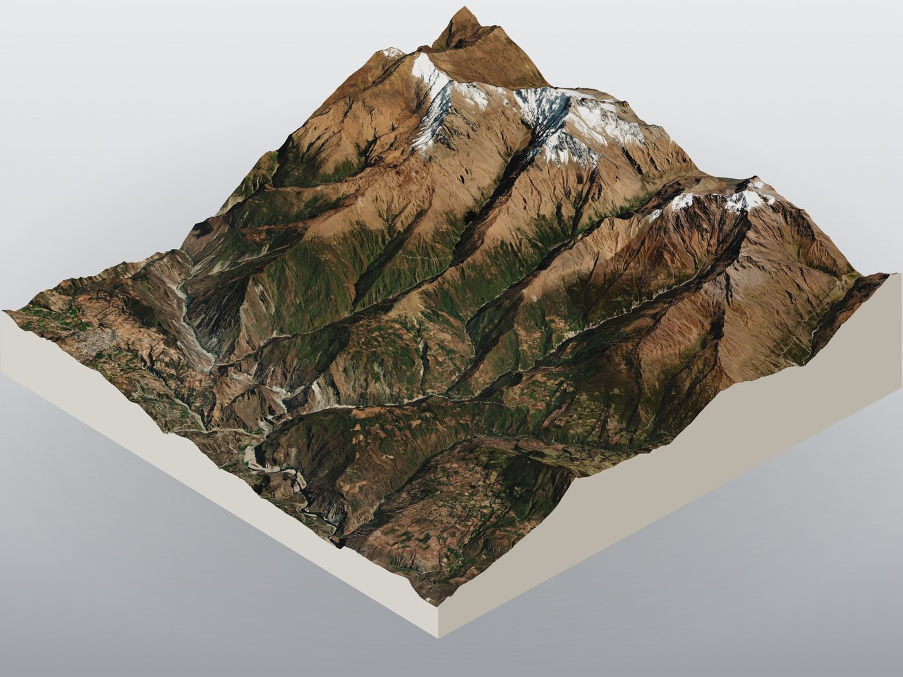
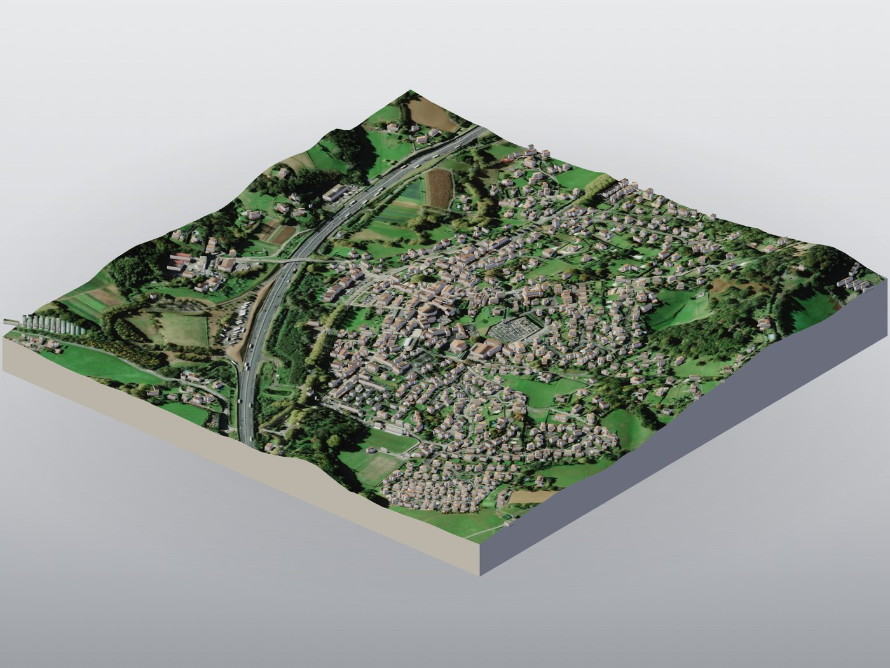
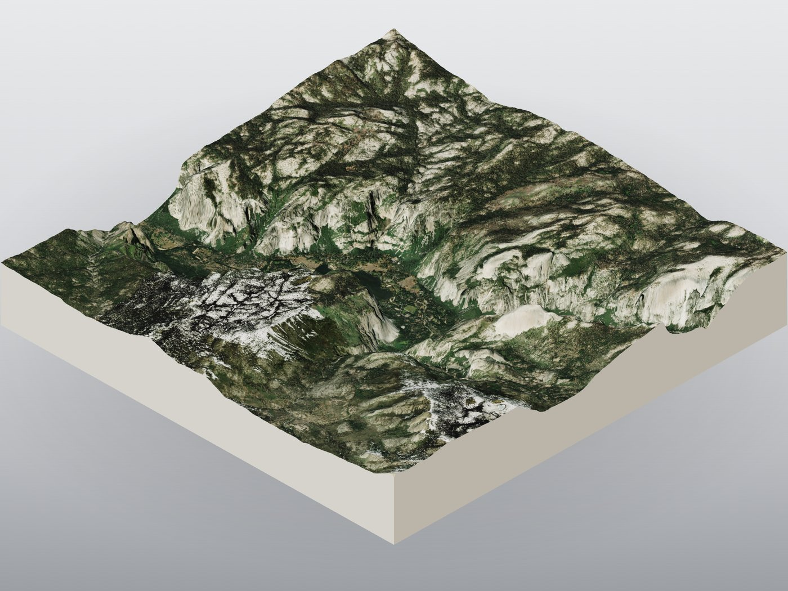
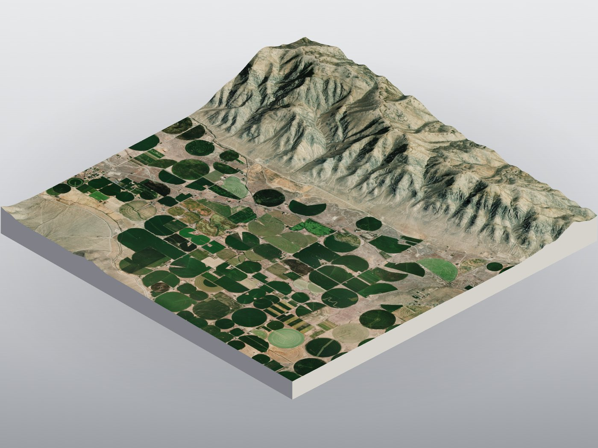

# Minimap Maker

Browser-based generator for map relief "pucks" - squared-off terrain tiles built
from satellite imagery draped over real elevation data. Pan a map, frame a
region, and a textured 3D model pops out the other end, ready to export as PNG,
WebM, STL, OBJ, or GLB.

## Gallery

<table>
  <tr>
    <td width="50%"><br><sub>Mollepata, Cusco</sub></td>
    <td width="50%"><br><sub>Urrugne, France</sub></td>
  </tr>
  <tr>
    <td><br><sub>Mariposa County, California</sub></td>
    <td><br><sub>Butte County, Idaho</sub></td>
  </tr>
</table>


## What it does

- **Frame** any spot on Earth on a satellite map with country borders and labels.
- **Capture** the region - imagery is stitched and draped over a real elevation
  model to build a 3D relief puck.
- **Style** it with filters, lighting, and z-exaggeration controls.
- **Export** as PNG, WebM, STL / OBJ, or
  GLB.
- **Save** pucks to a local in-browser library.

## Quick start

You need Python 3 and git. Clone the repo, install the dependencies, and run:

```bash
git clone https://github.com/drjenkin/minimaps.git
cd minimaps
pip install -r requirements.txt
python backend/app.py
```

Open <http://127.0.0.1:5001/> in your browser.

> **Tip:** to keep dependencies isolated, create and activate a Python virtual
> environment (`python -m venv .venv`) before running `pip install`.

On Windows, once cloned, you can also just double-click **`launch.bat`**, which
starts the server and opens the browser for you.

## Elevation data - pick your source

When you capture, choose an elevation source:

- **Copernicus DEM 30m** (default, sharpest) - served via
  [OpenTopography](https://opentopography.org), which needs a **free API key**.
  The app prompts you for it the first time; it's stored only in your browser.
- **AWS Terrain**: keyless and global, no signup. Pick this if you'd rather
  skip the key step.

## Data sources & attribution

Minimap Maker is a non-commercial, personal-use project. Pucks are derived works
of the data sources below - if you redistribute them, follow each provider's
licence terms.

- **Elevation**: Copernicus DEM (ESA) and AWS Open Terrain Tiles, via
  [OpenTopography](https://opentopography.org) where applicable.
- **Satellite imagery**: Esri World Imagery (© Esri, Maxar, Earthstar
  Geographics).
- **Map / buildings / water / labels**: ©
  [OpenStreetMap](https://www.openstreetmap.org/copyright) contributors and Esri
  reference layers.
- **Place names**: [Nominatim](https://nominatim.org) reverse geocoding.
- **3D engine**: [three.js](https://threejs.org).
- Built with the help of [Claude](https://claude.com/claude-code) 

## License

[MIT](LICENSE). Covers the Minimap Maker application code only - the map
data and imagery (Esri, OpenStreetMap, Copernicus, OpenTopography) remain
under their respective providers' terms.

## Credits

By [Mike](https://x.com/ShutterCG). If you enjoy Minimap Maker, you can
[buy me a coffee on Ko-fi](https://ko-fi.com/mike101441). ☕
